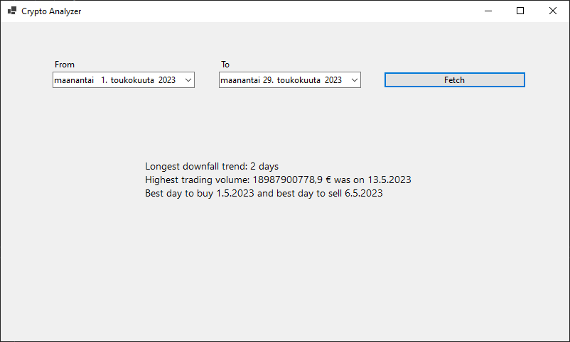

# CryptoAnalyzer

Bitcoin data analyzer using the [CoinGecko API](https://www.coingecko.com/en/api/documentation)

Made with Windows Forms and C#



This project is for the [Vincit Rising Star Pre-assignment](vincitpreassignment.md). I made this at school so i just copy pasted it here into its own repo.

## Installation
You can use the standalone executable in [releases](https://github.com/Saikkonen/CryptoAnalyzer/releases/latest)

Or if that doesn't work, you can build it from source

### Building

Clone the reposiory and change directory
```
git clone https://github.com/Saikkonen/CryptoAnalyzer.git
cd CryptoAnalyzer
```
Open the `.sln` file with Visual Studio

Then you can run the project in Visual Studio

## Usage
Select the date range and click the "Fetch" button
